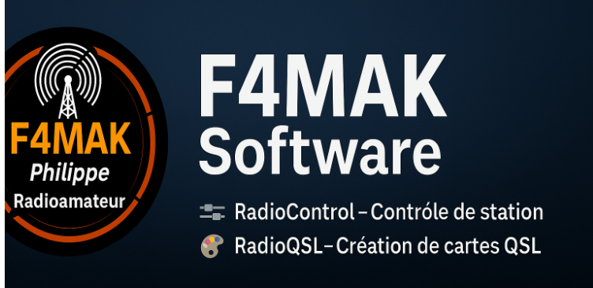

# 👋 Philippe (F4MAK)
📡 Radioamateur passionné — Auteur de la suite **F4MAK Software**  

### 🔹 Mes projets
- 🎛️ **[F4MAK RadioControl](https://github.com/Philippe51000/F4MAK-RadioControl)**  
   → Logiciel de contrôle et d’automatisation de station  

- 🎨 **[F4MAK RadioQSL](https://github.com/Philippe51000/F4MAK-RadioQSL)**  
   → Logiciel de création et gestion de cartes QSL  

---

💡 Bienvenue sur mon espace GitHub !  
