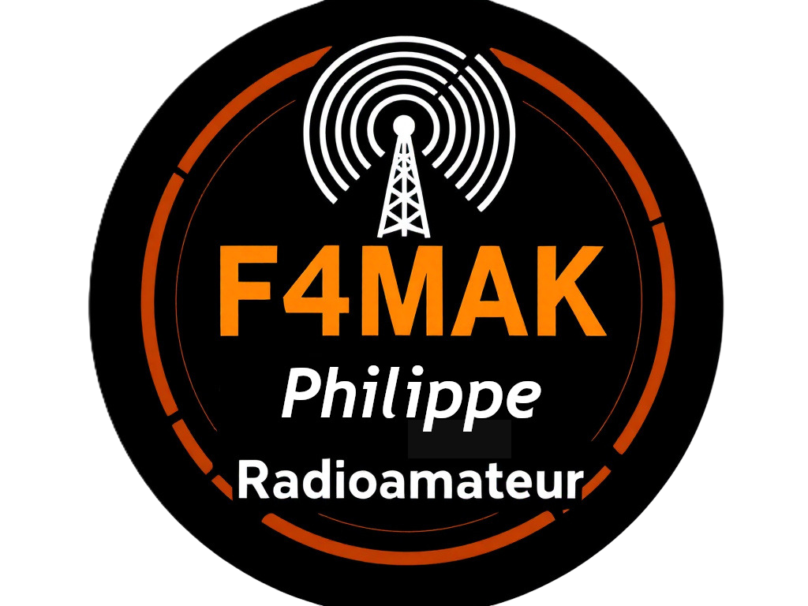

<!-- Bannière -->

# 👋 Philippe (F4MAK)

📡 **Radioamateur passionné (France)**  
Auteur de la suite **F4MAK Software**

---

## 🇫🇷 Mes projets
- 🎛️ [F4MAK-RadioControl](https://github.com/Philippe51000/F4MAK-RadioControl)  
   → Logiciel de contrôle et d’automatisation de station radio  

- 🎨 [F4MAK-RadioQSL](https://github.com/Philippe51000/F4MAK-RadioQSL)  
   → Logiciel de création et gestion de cartes QSL  

---

## 🌍 My Projects (English)
- 🎛️ [F4MAK-RadioControl](https://github.com/Philippe51000/F4MAK-RadioControl)  
   → Software to control and automate radio stations  

- 🎨 [F4MAK-RadioQSL](https://github.com/Philippe51000/F4MAK-RadioQSL)  
   → Software to design and manage QSL cards  

---

## 🔖 À propos
- Indicatif : **F4MAK Philippe**  
- Passion : Radioamateurisme, développement logiciel & automatisation  
- Suite logicielle : **F4MAK Software**  

---

  
   
  📡 F4MAK Software — Radioamateur

